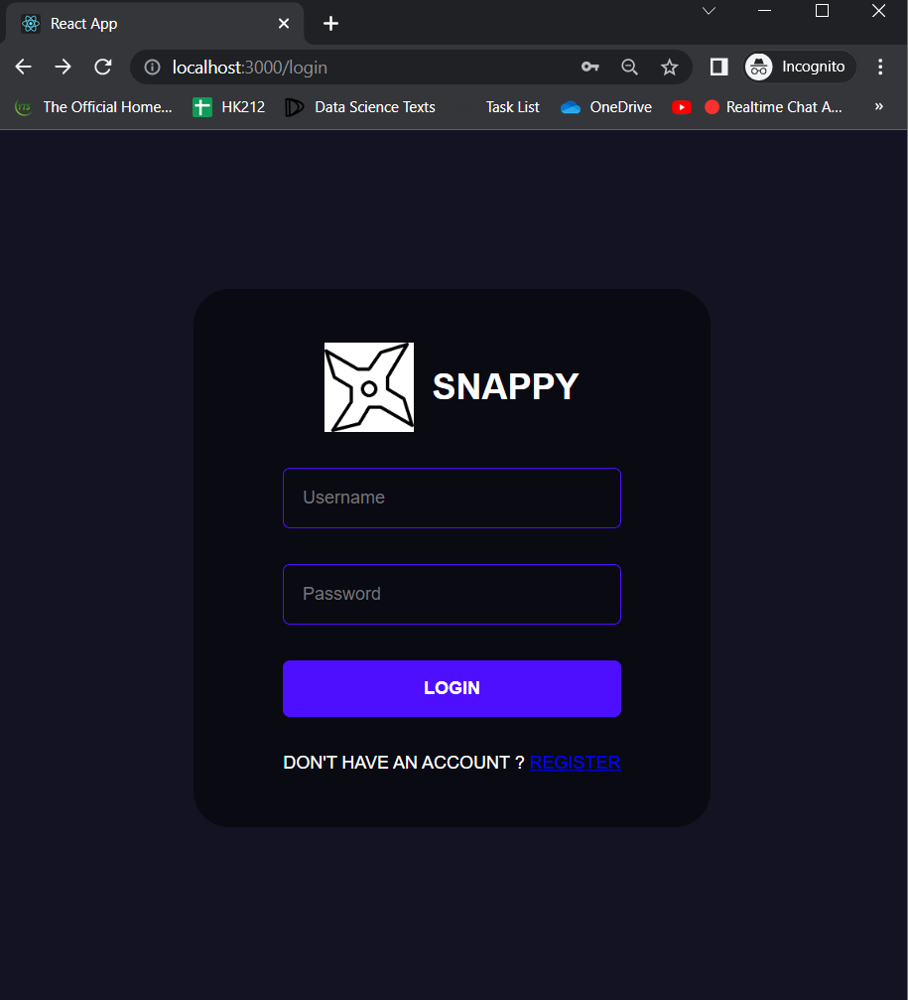
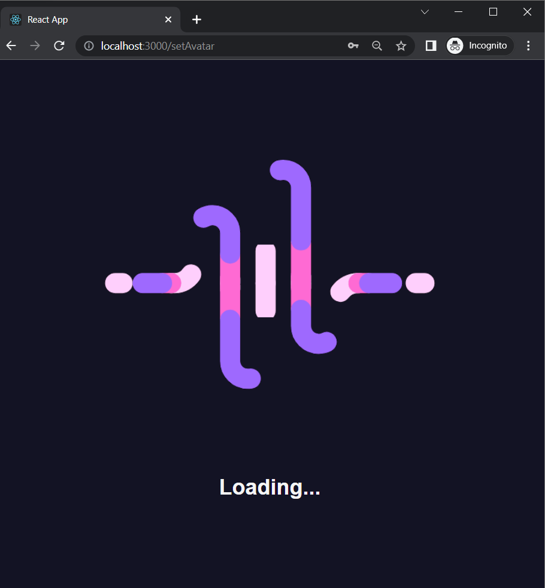
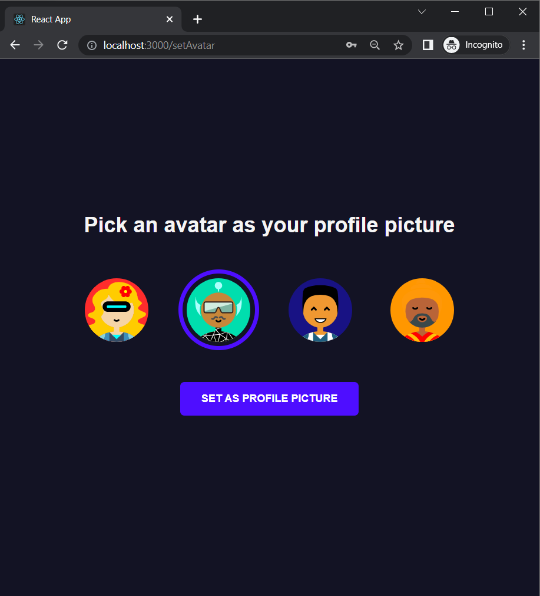
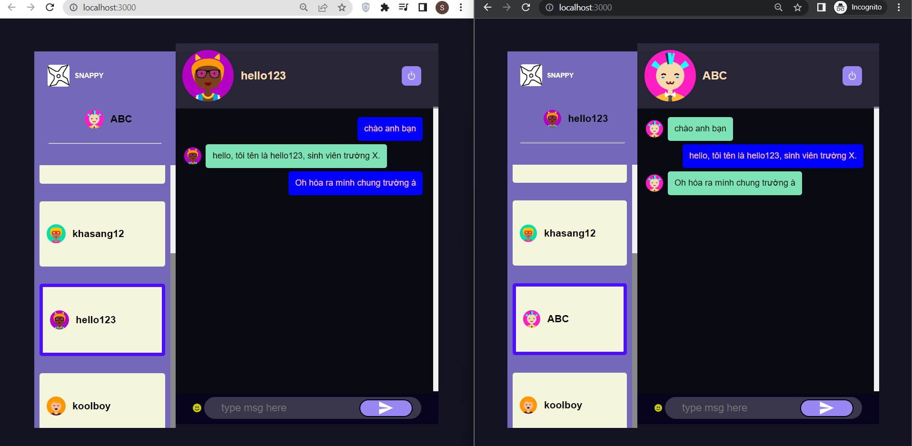

# ReactProjects_Summer2022

My return to MERN_Stack after nearly a year. This time, I managed to connect the app's Front-end to Back-end 😂, with the information of which was stored at MongoDB database.

This project's inspiration comes from Facebook Messenger, which is a prevalent ChatApp in the public nowadays. At the first stage, I will complete some of the important features for 
for a Chat Application, such as storing messages of each user and real-time sockets for chatting events. Then, I may integrate AI-related technologies, such as Natural Language Processing, 
to create an automatic ChatBot for my app.

Happy coding!

## Tech Stack

* Design Pattern: MVC (Model-View-Controller)
* Web Programming Language: JavaScript
* Front-end Framework: ReactJS
* Back-end Framework: NodeJS, ExpressJS
* Database: MongoDB (NoSQL)
* Libraries: socket.io (real-time chatting), font-awesome (beautiful icons), mongoose (MongoDB connection tool), and tons of other libraries =))

## Login Interface

## Register Interface

## Connect Interface

## Pick Avatar Interface

## Menu Interface

## Chat App Interface

